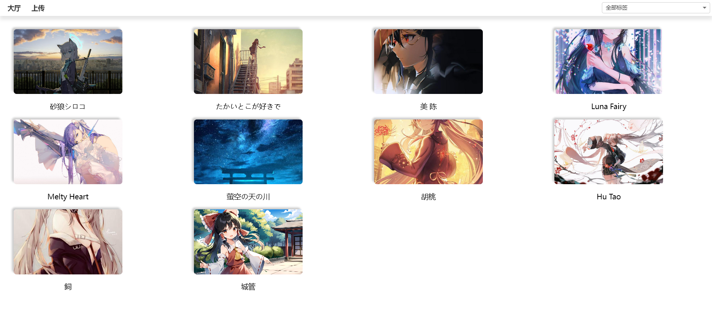

<p align="center">
</p>


## Introduction

#### This project is used for image storage and display on the web




## Features

- Upload images in browser
- Display images on the web
- Ability to comment on images
- Ability to add stars to pictures
- Classify and display by tags
- No login required and no traces left


## Build Setup

``` bash
# In the project root directory
go build .
```


## Licence

[GPL-3.0](https://github.com/succerseng/PaintingHosting/blob/main/LICENSE)
